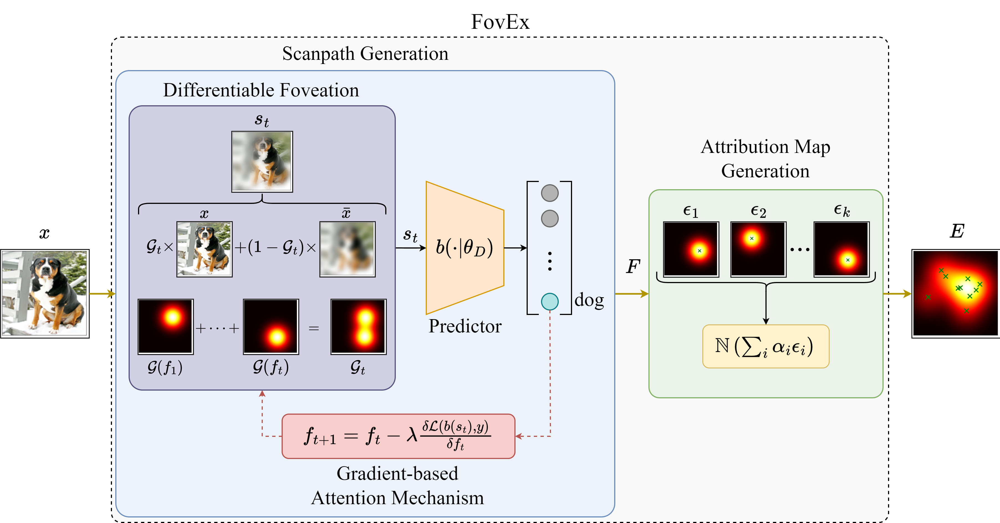
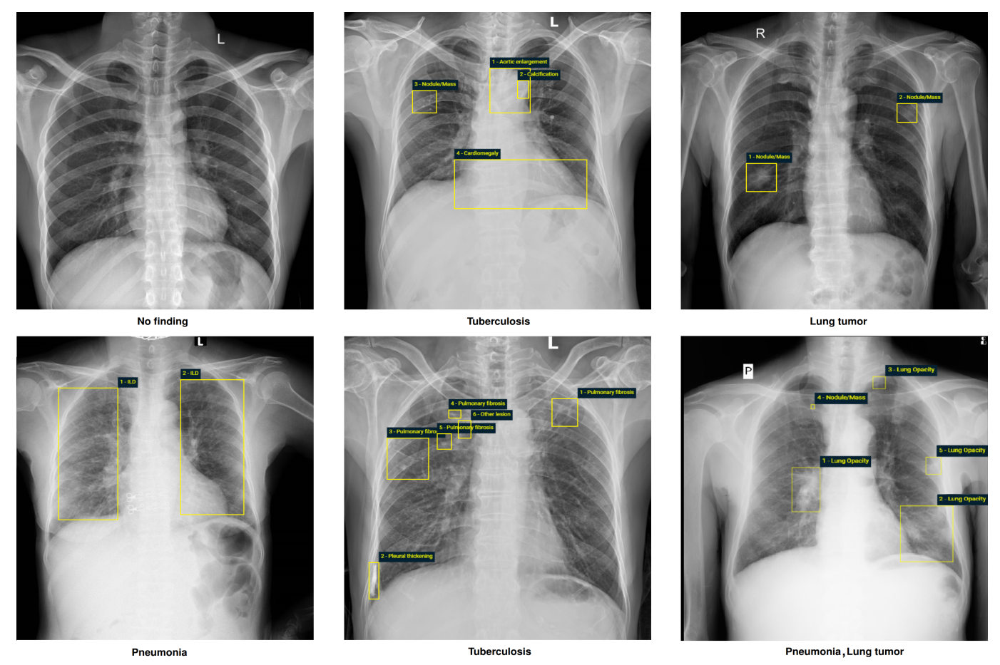
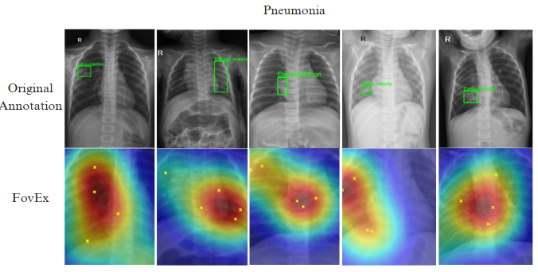

# Foveation-based Explanations for Chest X-Ray Classification

## Overview
This project focuses on identifying critical regions in chest X-ray images to support medical image classification using the **Foveation-based Explanations (FovEx)** method with a **ResNet-50** model. By mimicking human vision's foveation mechanism, FovEx generates attention maps to highlight important areas, aiding in the diagnosis of abnormalities in chest X-rays.


*Figure: Illustration of the FovEx method applied to a chest X-ray, highlighting critical regions.*

## Objectives
- Develop and apply the FovEx method to locate focal regions in chest X-ray images.
- Evaluate performance on multiple datasets and compare with baseline methods like RandomCAM.
- Optimize key parameters to balance accuracy and computational efficiency.

## Methodology
- **Model**: ResNet-50, fine-tuned on ImageNet.
- **FovEx Approach**:
  - Combines original and Gaussian-blurred images to focus on central regions.
  - Uses gradient-based attention to iteratively identify critical areas.
  - Synthesizes normalized attention maps for visualization.
- **Parameters**:
  - Foveation Sigma (σ_f): Controls sharp region size.
  - Forgetting Factor (β): Adjusts memory retention.
  - Scanpath Length (N): Number of focal points.
  - Optimization Steps (OS): Iterations for focal point optimization.
  - Blur Sigma (σ_b): Degree of peripheral blurring.

## Datasets
- **Chest X-Ray Images (Pneumonia)**: Kaggle dataset for pneumonia detection.
- **NIH Chest X-Rays**: Multi-label chest X-ray dataset.
- **VinDr-PCXR**: Pediatric chest X-ray dataset.


*Figure: Sample chest X-ray with expert-annotated regions used for evaluating FovEx performance.*

## Results
- FovEx outperforms RandomCAM across key metrics:
  - AVG. % DROP: 10.125 (FovEx) vs. 24.421 (RandomCAM).
  - AVG. % INCREASE: 28.432 (FovEx) vs. 16.021 (RandomCAM).
  - DELETE: 0.012 (FovEx) vs. 0.398 (RandomCAM).
  - INSERT: 95.680 (FovEx) vs. 89.412 (RandomCAM).
- Attention maps align closely with expert-annotated regions, enhancing diagnostic support.
- Optimal parameters: σ_f = 0.3, β = 0.05, N = 5, OS = 50, σ_b = 5.


*Figure: Combined visualization showing the original X-ray, expert annotations (green bounding boxes), and FovEx heatmap (semi-transparent, jet colormap).*

## Installation
1. Clone the repository:
   ```bash
   git clone https://github.com/your-username/your-repo-name.git